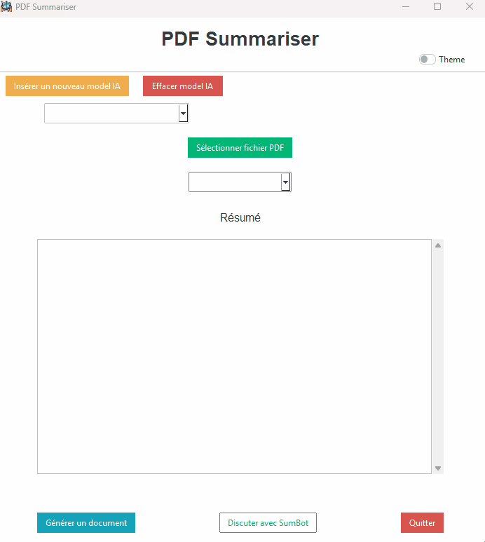

# PDF Summariser 🤖📖

# [README in english just here !](README.md)

## Description

**PDF Summariser** a pour objectif de résumer des fichiers PDF. L'application permet d'insérer des fichiers PDF, qui seront résumés en un maximum de 1400 mots, selon le choix de l'utilisateur. En outre, elle offre la possibilité de traduire les résumés en français, anglais ou allemand.

Le résumé généré peut être enregistré au format **doc** ou **txt**.
L’application inclut également un chatbot capable de répondre aux questions concernant le fichier PDF fourni ainsi que son résumé.

### [Installation du projet pour le développement](#installation-du-projet-pour-le-développement)

---

## Télécharger l'application

- **Téléchargez l'installeur** [ici depuis le lien Google Drive](https://drive.google.com/file/d/1BBQ5qoO_sjPhNBxgeVlztx5BLySdJlAA/view?usp=sharing) et installer l'application pour la tester.

---

## Fonctionnalités :

- **Résumé des fichiers PDF** : Résume les fichiers PDF en fonction des préférences de l'utilisateur (jusqu’à 1400 mots maximum).
- **Traduction multilingue** : Traduction des résumés en français, anglais ou allemand.
- **Chatbot intégré** : Permet de poser des questions sur le contenu du PDF et son résumé, pour une exploration interactive de la documentation.
- **Export des résumés** : Enregistrement des résumés au format DOC (Word) ou TXT pour une conservation ou un partage facile.
- **Stockage des modèles IA** : Les modèles IA sont stockés et configurés au format JSON dans l'application, permettant l'utilisation de plusieurs fournisseurs (OpenAI, Google Gemini, Ollama, etc.).
- **Thèmes clairs et sombres** : L'interface propose un mode clair ou sombre, personnalisable pour un confort visuel optimal.
- **Interface intuitive** : Conçue avec Tkinter et ttkbootstrap pour une expérience utilisateur simple et agréable.
- **Installation facile** : Distribuée via un installeur Windows (.exe) créé avec InstallForge.
- **Téléchargement automatique du modèle Ollama** : si un modèle Ollama local est sélectionné, l'application télécharge et installe automatiquement le modèle requis.

# Demo


Démo d'un résumé en français



Démo d'un résumé en anglais


Démo d'un résumé en allemand (avec la version 1.0 de PDF Summerasier)


Démonstration du chatbot répondant aux questions basées sur le résumé du PDF.  
Le bot facilite l'exploration interactive du document en répondant aux questions de l'utilisateur.


Enregistrer un résumé en format txt


Enregistrer un résumé en format doc


Démonstration thème clair/sombre

---

## Apprentissage :

Ce projet m’a permis d’approfondir mes connaissances sur différents aspects :

1. **Manipulation des modèles IA** : J'ai appris à manipuler des modèles IA pour réaliser des tâches précises.
2. **Manipulation des fichiers en Python** : Exploration et gestion des fichiers PDF, avec compréhension approfondie des données.
3. **Stockage et gestion des données** : Utilisation de formats JSON pour stocker et manipuler les données.
4. **Interface utilisateur avec Tkinter** : Création d’une interface graphique conviviale avec **Tkinter** et **Ttkbootstrap**.
5. **Programmation orientée objet (POO)** : Utilisation de la POO pour structurer le code de manière plus modulaire et extensible.
6. **Installeur d’application** : Utilisation de **InstallForge** pour faciliter le déploiement.

**L’objectif principal** était d’accroître mes connaissances sur les modèles IA, leurs différentes marques et modèles (benchmark) et d'être capable de les manipuler afin de réaliser des tâches précises.

---

## Utilisation

### Ollama

#### A noter :

Pour l'utilisation du modèle Llama 3.2, il faut avoir téléchargé **Ollama** en local, sinon le modèle ne fonctionnera pas.

- **API KEY** : `ollama` (doit être rempli, mais n’est pas utilisé directement dans le code)
- **Nom du modèle** : `llama3.2` (par exemple)
- **Base URL** : `http://localhost:11434/v1`

---

### Google :

Vous pouvez utiliser une clé **Gemini** gratuite, disponible sur [https://ai.google.dev/](https://ai.google.dev/).

- **API KEY** : votre clé API
- **Nom du modèle** : `gemini-1.5-flash` (par exemple)
- **Base URL** : `https://generativelanguage.googleapis.com/v1beta/openai/`

**Note** : Il est préférable d'utiliser le modèle `gemini-1.5-flash` plutôt que le modèle `gemini-1.5-flash-8b`, car ce dernier rencontre des difficultés à traduire les textes.

---

### OpenAI :

Il faut obtenir une clé sur [https://platform.openai.com/api-keys](https://platform.openai.com/api-keys).

- **API KEY** : votre clé API
- **Nom du modèle** : `gpt-4o-mini` (par exemple)
- **Base URL** : laisser vide

---

### Autres modèles IA :

Vous pouvez également insérer d'autres modèles IA, mais il est nécessaire de consulter leur documentation officielle pour savoir comment configurer leurs API clés et bases URL.

---

# Installation du projet pour le développement

## 1. Créer et activer un environnement virtuel

```bash
python -m venv .venv
```

Après, activez l'environement virtuel

Sur Windows :

```bash
python -m venv .venv
.\.venv\Scripts\activate
```

Sur Linux :

```bash
python3 -m venv .venv
source .venv/bin/activate
```

## 2. Installer les dépendances Python

```bash
pip install -r requirements.txt
```

## 3. Installer les outils externes

Le projet nécessite trois outils externes :

- **Ollama**
- **Poppler**
- **Tesseract-OCR**

Vous avez deux possibilités :

1. **Les installer directement sur votre PC** (méthode classique)
2. **OU** les placer **dans les dossiers du projet**, comme dans la version installée (.exe),  
   et suivre les instructions fournies dans chaque README dédié.

Ainsi, si vous installez les outils sur votre machine, il n'y a **rien d'autre à faire**.  
Si vous préférez les inclure dans le projet, vous devez suivre les instructions fournies dans les répertoires correspondants.

---

### Installer Ollama

Téléchargement :  
https://ollama.com/

Instructions pour l’installer **dans le projet** :  
[PDF-Summariser/Ollama/README.fr.md](/PDF-Summariser/Ollama/README.fr.md)

---

### Installer Poppler

Téléchargement :  
https://github.com/oschwartz10612/poppler-windows/releases

Instructions pour l’installer **dans le projet** :  
[PDF-Summariser/poppler-24.08.0/README.fr.md](/PDF-Summariser/poppler-24.08.0/README.fr.md)

---

### Installer Tesseract-OCR

Téléchargement :  
https://digi.bib.uni-mannheim.de/tesseract/

Instructions pour l’installer **dans le projet** :  
[PDF-Summariser/Tesseract-OCR/README.fr.md](/PDF-Summariser/Tesseract-OCR/README.fr.md)

---

## Remerciements

Merci à David De Groote, qui nous a donné un séminaire très intéressant sur l'IA à l'École d'Informatique de Gestion de Delémont. Grâce à ce cours, j'ai pu réaliser ce projet. Son GitBook est disponible dans les liens ci-dessous.

---

## Liens :

- [Installation Package OpenAI - ESIG](https://esig.degroote.ch/mardi-3-decembre-2024/pratique-api/installation-package-openai-et-test)
- [OpenAI API Documentation](https://platform.openai.com/docs/api-reference/introduction)
- [OpenAI Overview](https://platform.openai.com/docs/overview)
- [openai-python GitHub Repository](https://github.com/openai/openai-python)
- [Ollama](https://ollama.com/)
- [python-json-config sur PyPI](https://pypi.org/project/python-json-config/)
- [Append to JSON file using Python - GeeksforGeeks](https://www.geeksforgeeks.org/append-to-json-file-using-python/)
- [Tkinter messagebox Documentation](https://docs.python.org/3/library/tkinter.messagebox.html)
- [PyPDF GitHub Repository](https://github.com/py-pdf/pypdf)
- [PDF Reader Tutorial](https://pdfreader.readthedocs.io/en/latest/tutorial.html)
- [Classes et Objets - Courspython](https://courspython.com/classes-et-objets.html)
- [Tkinter Dark/Light Theme Switching - YouTube](https://www.youtube.com/watch?v=PIaccbMT6fo)
- [ttkbootstrap Documentation](https://ttkbootstrap.readthedocs.io)
- [ttkbootstrap GitHub Repository](https://github.com/israel-dryer/ttkbootstrap)
- [Centering a Window on the Screen in Tkinter - GeeksforGeeks](https://www.geeksforgeeks.org/how-to-center-a-window-on-the-screen-in-tkinter/)
- [Tkinter Checkbutton Widget - GeeksforGeeks](https://www.geeksforgeeks.org/python-tkinter-checkbutton-widget/)
- [Close a Tkinter Window with a Button - GeeksforGeeks](https://www.geeksforgeeks.org/how-to-close-a-tkinter-window-with-a-button/)
- [Switch between Dark and Light ttk Theme - Stack Overflow](https://stackoverflow.com/questions/66576662/how-to-switch-between-dark-and-light-ttk-theme)
- [Tkinter Separator - Python Tutorial](https://www.pythontutorial.net/tkinter/tkinter-separator/)
- [Tkinter Anchors - TutorialsPoint](https://www.tutorialspoint.com/python/tk_anchors.htm)
- [Tkinter ttk Documentation](https://docs.python.org/fr/3.13/library/tkinter.ttk.html)
- Logo Source: [Livres - Flaticon](https://www.flaticon.com/fr/chercher?word=livre)
