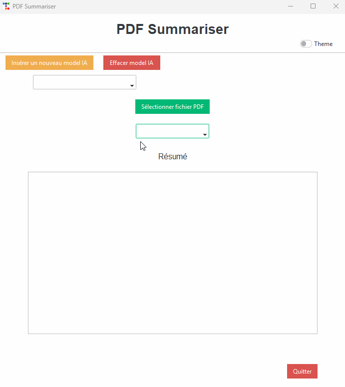
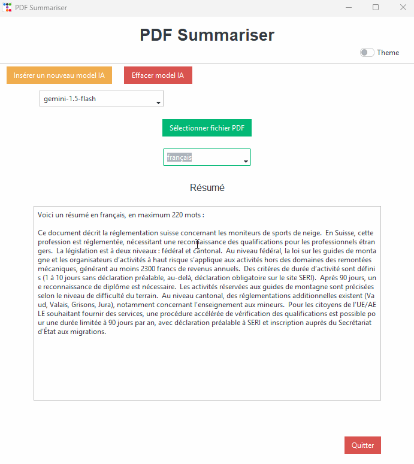
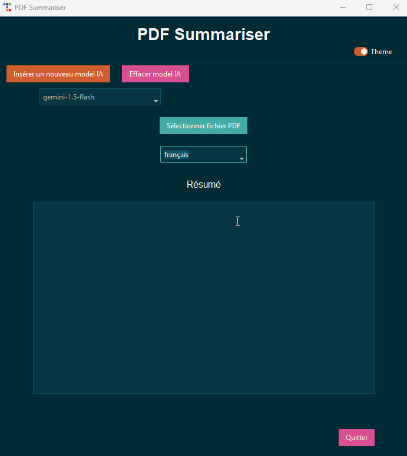
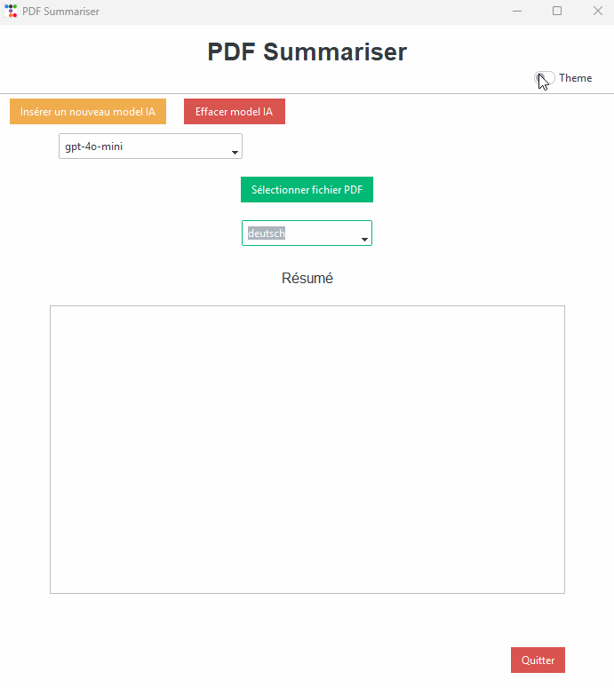

# PDF Summariser  🤖📖

[Le README en français juste ici!](README.fr.md)

## Description  
**PDF Summariser** is designed to summarize PDF files. The application lets you insert PDF files, which will be summarized in a maximum of 1400 words, according to the user's choice. It also offers the option of translating summaries into French, English or German.

---

## Application

-**Download the installer** (Installer_PDF_Summariser.exe) and install the application to test it.

---

## Features :  
- **PDF file summary** : Summarizes PDF files according to user preferences (up to 1400 words).  
- **Multilingual translation** : Translation of summaries into French, English or German.  
- **IA template storage** : IA templates are stored in JSON format within the application.  
- **Themes** : The application can be in a light or dark theme.  

---

# Demo

French summary demo

English summary demo

German summary demo

Demonstration of light/dark theme

---

## Learning:  
This project has enabled me to deepen my knowledge on various aspects:  
1. **AI model manipulation**: I learned how to manipulate AI models, as well as how to use them.  
2. **File manipulation in Python**: Exploration and management of PDF files, with in-depth understanding of the data.  
3. **Multilingual translation**: Learned translation techniques in French, English and German.  
4. **Data storage and management**: Use of JSON formats to store and manipulate data.  
5. User interface with Tkinter**: Create a user-friendly graphical interface with **Tkinter** and *Tkinter**.
6. **Object-oriented programming (OOP)**: Using OOP to structure code in a more modular and extensible way.  
7. **Application installer**: Use of **InstallForge** to facilitate deployment. 

**The main objective** was to increase my knowledge of AI models, their different brands and models (benchmark).

---

## Use

### Ollama 
#### Please note:  
To use the Llama 3.2 model, you need to have downloaded **Ollama** locally, otherwise the model won't work.  

- API KEY** : `ollama` (must be filled in, but is not used directly in the code)  
- Template name**: `llama3.2` (for example)  
- Base URL**: `http://localhost:11434/v1`

---

### Google:  
You can use a free **Gemini** key, available at [https://ai.google.dev/](https://ai.google.dev/).  
- API KEY** : your API key  
- Model name** : `gemini-1.5-flash` (for example)  
- Base URL**: `https://generativelanguage.googleapis.com/v1beta/openai/`

---

### OpenAI:  
You need to get a key from [https://platform.openai.com/api-keys](https://platform.openai.com/api-keys).
- API KEY** : your API key  
- Model name** : `gpt-4o-mini` (for example)  
- Base URL** : leave empty  

---

### Other IA templates :  
You can also insert other IA templates, but you'll need to consult their official documentation to find out how to configure their API keys and URL bases.

---

## Problems encountered:  
- Language changes may not work correctly depending on the AI model selected.
- Some AI models may have difficulty translating text.
- If you use Ollama models locally, loading times may vary, depending on the processor you're using.

---

## What could be improved :  
- **AI template management interface** : A window for viewing and configuring all AI templates and their settings.  
- Resolution of the above-mentioned bug.  
- **Summary storage** : Enable summaries to be stored for easy access in the future.  
- **OCR support for PDF files** : The current library does not support scanned PDFs.  
- Add the ability to read Word and OCR files.
- Add an **asynchronous** request to display the summary incrementally, so part of the text is shown even before the summarization is complete, allowing the user to start reading without waiting.

---
## Please note:
At first, the code was procedural and the template was stored in an .env, as I wasn't sure where I was going and was testing. Then I decided to switch to an object-oriented approach when I saw that I was going a bit further. This meant that the code was more modular and extensible. For example, I could easily add extra functionality. In fact, I don't think I'll be modifying the code any time soon, but if I do, I plan to add features such as Word file reading and PDF OCR support in the future. I'd also like to add a few more windows and some user controls.
The procedural code is available in the pdf-summariser-procedural folder.

---

## Conclusion : 
Despite the fact that the application needs a few optimizations (which I won't have time to modify because of school, I have projects to hand in and exams to do), I'm very satisfied with the skills I've acquired, particularly in AI and the use of InstallForge. InstallForge has also enabled me to indirectly understand some very interesting system concepts that I didn't know before. I'm also glad I used Ttkboostrap for the frontend, as I already like and use this frontend for websites, even if I much prefer to use it in HTML, as I find the structure better in HTML than in Python.

---

## Thanks
Thanks to David De Groote, who gave us a very interesting seminar on AI at the "École d'Informatique de Gestion" in Delémont (School of Business Information Technology or School of Business Informatics, in english according to deepl and chatgpt). Thanks to this course, I was able to realize this project. His GitBook is available in the links below.

---

## Links :
- [Installation Package OpenAI - ESIG](https://esig.degroote.ch/mardi-3-decembre-2024/pratique-api/installation-package-openai-et-test)
- [OpenAI API Documentation](https://platform.openai.com/docs/api-reference/introduction)
- [OpenAI Overview](https://platform.openai.com/docs/overview)
- [openai-python GitHub Repository](https://github.com/openai/openai-python)
- [Ollama](https://ollama.com/)
- [python-json-config sur PyPI](https://pypi.org/project/python-json-config/)
- [Append to JSON file using Python - GeeksforGeeks](https://www.geeksforgeeks.org/append-to-json-file-using-python/)
- [Tkinter messagebox Documentation](https://docs.python.org/3/library/tkinter.messagebox.html)
- [PyPDF GitHub Repository](https://github.com/py-pdf/pypdf)
- [PDF Reader Tutorial](https://pdfreader.readthedocs.io/en/latest/tutorial.html)
- [Classes et Objets - Courspython](https://courspython.com/classes-et-objets.html)
- [Tkinter Dark/Light Theme Switching - YouTube](https://www.youtube.com/watch?v=PIaccbMT6fo)
- [ttkbootstrap Documentation](https://ttkbootstrap.readthedocs.io)
- [ttkbootstrap GitHub Repository](https://github.com/israel-dryer/ttkbootstrap)
- [Centering a Window on the Screen in Tkinter - GeeksforGeeks](https://www.geeksforgeeks.org/how-to-center-a-window-on-the-screen-in-tkinter/)
- [Tkinter Checkbutton Widget - GeeksforGeeks](https://www.geeksforgeeks.org/python-tkinter-checkbutton-widget/)
- [Close a Tkinter Window with a Button - GeeksforGeeks](https://www.geeksforgeeks.org/how-to-close-a-tkinter-window-with-a-button/)
- [Switch between Dark and Light ttk Theme - Stack Overflow](https://stackoverflow.com/questions/66576662/how-to-switch-between-dark-and-light-ttk-theme)
- [Tkinter Separator - Python Tutorial](https://www.pythontutorial.net/tkinter/tkinter-separator/)
- [Tkinter Anchors - TutorialsPoint](https://www.tutorialspoint.com/python/tk_anchors.htm)
- [Tkinter ttk Documentation](https://docs.python.org/fr/3.13/library/tkinter.ttk.html)
- Logo Source: [Livres - Flaticon](https://www.flaticon.com/fr/chercher?word=livre)
