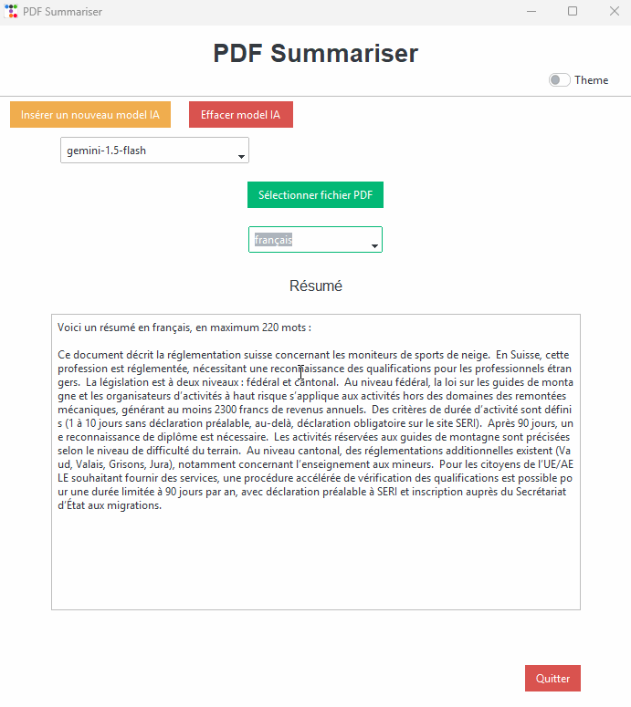
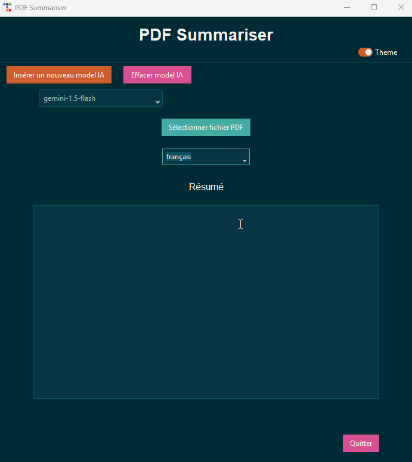

# PDF Summariser 🤖📖

## Description  
**PDF Summariser** a pour objectif de résumer des fichiers PDF. L'application permet d'insérer des fichiers PDF, qui seront résumés en un maximum de 1400 mots, selon le choix de l'utilisateur. En outre, elle offre la possibilité de traduire les résumés en français, anglais ou allemand.

---

## Application

- **Téléchargez l'installeur** (Installer_PDF_Summariser.exe) et installer l'application pour la tester.

---

## Fonctionnalités :  
- **Résumé des fichiers PDF** : Résume  les fichiers PDF en fonction des préférences de l'utilisateur (jusqu’à 1400 mots maximum).  
- **Traduction multilingue** : Traduction des résumés en français, anglais ou allemand.  
- **Stockage des modèles IA** : Les modèles IA sont stockés au format JSON dans l'application.  
- **Thèmes** : L'application peut être dans un thème clair ou sombre.  

---

# Demo

Démo d'un résumé en français

Démo d'un résumé en anglais

Démo d'un résumé en allemand

Démonstration thème clair/sombre

---

## Apprentissage :  
Ce projet m’a permis d’approfondir mes connaissances sur différents aspects :  
1. **Manipulation des modèles IA** : J'ai appris à manipuler des modèles IA pour réaliser des tâches précises.
2. **Manipulation des fichiers en Python** : Exploration et gestion des fichiers PDF, avec compréhension approfondie des données.  
3. **Stockage et gestion des données** : Utilisation de formats JSON pour stocker et manipuler les données.  
4. **Interface utilisateur avec Tkinter** : Création d’une interface graphique conviviale avec **Tkinter** et **Ttkbootstrap**.  
5. **Programmation orientée objet (POO)** : Utilisation de la POO pour structurer le code de manière plus modulaire et extensible.  
6. **Installeur d’application** : Utilisation de **InstallForge** pour faciliter le déploiement. 

**L’objectif principal** était d’accroître mes connaissances sur les modèles IA, leurs différentes marques et modèles (benchmark) et d'être capable de les manipuler afin de réaliser des tâches précises.

---

## Utilisation

### Ollama 
#### A noter :  
Pour l'utilisation du modèle Llama 3.2, il faut avoir téléchargé **Ollama** en local, sinon le modèle ne fonctionnera pas.  

- **API KEY** : `ollama` (doit être rempli, mais n’est pas utilisé directement dans le code)  
- **Nom du modèle** : `llama3.2` (par exemple)  
- **Base URL** : `http://localhost:11434/v1`

---

### Google :  
Vous pouvez utiliser une clé **Gemini** gratuite, disponible sur [https://ai.google.dev/](https://ai.google.dev/).  
- **API KEY** : votre clé API  
- **Nom du modèle**  : `gemini-1.5-flash` (par exemple)  
- **Base URL** : `https://generativelanguage.googleapis.com/v1beta/openai/`

**Note** : Il est préférable d'utiliser le modèle `gemini-1.5-flash` plutôt que le modèle `gemini-1.5-flash-8b`, car ce dernier rencontre des difficultés à traduire les textes.

---

### OpenAI :  
Il faut obtenir une clé sur [https://platform.openai.com/api-keys](https://platform.openai.com/api-keys).
- **API KEY** : votre clé API  
- **Nom du modèle** : `gpt-4o-mini` (par exemple)  
- **Base URL** : laisser vide  

---

### Autres modèles IA :  
Vous pouvez également insérer d'autres modèles IA, mais il est nécessaire de consulter leur documentation officielle pour savoir comment configurer leurs API clés et bases URL.

---

## Problèmes rencontrés :  
- Les changements de langue ne fonctionnent parfois pas correctement selon le modèle IA choisi.
- Certains modèles d'IA peuvent rencontrer des difficultés à traduire les textes. 
- Si vous utilisez les modèles Ollama en local, le temps de chargement peut varier, notamment en fonction du processeur que vous utilisez.

---

## Ce qui pourrait être amélioré :  
- **Interface de gestion des modèles IA** : Une fenêtre permettant de voir et de configurer tous les modèles IA et leurs paramètres.  
- Résolution du bogue mentionné précédemment.  
- **Conservation des résumés** : Permettre de stocker les résumés pour un accès facile à l’avenir.  
- **Prise en charge OCR pour les fichiers PDF** : La bibliothèque actuelle ne supporte pas les PDF scannés.  
- Ajouter la possibilité pour la lecture des fichiers **Word** et **OCR**.
- Ajouter une interface graphique en anglais et en allemand
- Ajouter une requête **asynchrone** pour afficher le résumé de manière incrémentale, de sorte qu'une partie du texte soit affichée avant même que le résumé ne soit terminé, ce qui permet à l'utilisateur de commencer à lire sans attendre.
- Ajouter un tuto pour l'utilisateur.

---

## A noter :
Au début, le code était en procédural et le modèle était stocké dans un .env, car je ne savais pas trop où j’allais et je testais. Ensuite, j’ai décidé de passer à une approche orientée objet lorsque j’ai vu que j’allais un peu plus loin. Cela permet d’avoir un code plus modulable et extensible. Je pourrais par exemple facilement ajouter des fonctionnalités supplémentaires. D’ailleurs, je ne pense pas modifier le code prochainement, mais si je le fais, j’envisage à l’avenir d’ajouter des fonctionnalités telles que la lecture de fichiers Word et la prise en charge de PDF OCR. J’aimerais également rajouter quelques fenêtres supplémentaires ainsi que quelques contrôles utilisateur.

---

## Conclusion :  
Malgré que l’application mérite quelque optimisations (que je n’aurais pas le temps de modifier à cause de l’école, j’ai des projets à rendre et des examens à faire), je suis très satisfait des compétences acquises, particulièrement en IA et l'utilisation InstallForge. InstallForge m'a en plus permis de comprendre indirectement quelques concepts systèmes très interessant que je ne connaissais pas encore. Je suis aussi content d'avoir utilisé Ttkboostrap pour faire le frontend, car j'aime et utilise déjà ce frontend pour les sites webs, même si je préfère largement l'utiliser en HTML, car je trouve la structure meilleure en HTML comparé à Python.

---

## Remerciements
Merci à David De Groote, qui nous a donné un séminaire très intéressant sur l'IA à l'École d'Informatique de Gestion de Delémont. Grâce à ce cours, j'ai pu réaliser ce projet. Son GitBook est disponible dans les liens ci-dessous.

---

## Liens :
- [Installation Package OpenAI - ESIG](https://esig.degroote.ch/mardi-3-decembre-2024/pratique-api/installation-package-openai-et-test)
- [OpenAI API Documentation](https://platform.openai.com/docs/api-reference/introduction)
- [OpenAI Overview](https://platform.openai.com/docs/overview)
- [openai-python GitHub Repository](https://github.com/openai/openai-python)
- [Ollama](https://ollama.com/)
- [python-json-config sur PyPI](https://pypi.org/project/python-json-config/)
- [Append to JSON file using Python - GeeksforGeeks](https://www.geeksforgeeks.org/append-to-json-file-using-python/)
- [Tkinter messagebox Documentation](https://docs.python.org/3/library/tkinter.messagebox.html)
- [PyPDF GitHub Repository](https://github.com/py-pdf/pypdf)
- [PDF Reader Tutorial](https://pdfreader.readthedocs.io/en/latest/tutorial.html)
- [Classes et Objets - Courspython](https://courspython.com/classes-et-objets.html)
- [Tkinter Dark/Light Theme Switching - YouTube](https://www.youtube.com/watch?v=PIaccbMT6fo)
- [ttkbootstrap Documentation](https://ttkbootstrap.readthedocs.io)
- [ttkbootstrap GitHub Repository](https://github.com/israel-dryer/ttkbootstrap)
- [Centering a Window on the Screen in Tkinter - GeeksforGeeks](https://www.geeksforgeeks.org/how-to-center-a-window-on-the-screen-in-tkinter/)
- [Tkinter Checkbutton Widget - GeeksforGeeks](https://www.geeksforgeeks.org/python-tkinter-checkbutton-widget/)
- [Close a Tkinter Window with a Button - GeeksforGeeks](https://www.geeksforgeeks.org/how-to-close-a-tkinter-window-with-a-button/)
- [Switch between Dark and Light ttk Theme - Stack Overflow](https://stackoverflow.com/questions/66576662/how-to-switch-between-dark-and-light-ttk-theme)
- [Tkinter Separator - Python Tutorial](https://www.pythontutorial.net/tkinter/tkinter-separator/)
- [Tkinter Anchors - TutorialsPoint](https://www.tutorialspoint.com/python/tk_anchors.htm)
- [Tkinter ttk Documentation](https://docs.python.org/fr/3.13/library/tkinter.ttk.html)
- Logo Source: [Livres - Flaticon](https://www.flaticon.com/fr/chercher?word=livre)
